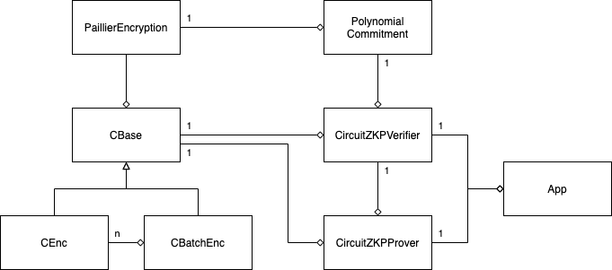

# Crypto Library

## Design



In the library, there are mainly 8 classes, with some utils classes. The relationship of the major classes are illustrated in above class diagram, and the description of each major classes are listed below:

### PaillierEncryption

_PaillierEncryption_ represents the paillier group elements with at least a public key or a public-key-private-key pair. Depends on the value it has, it is used in encryption, decryption, commitment and zero-knowledge(ZKP) prove protocols. Also, there are some static function for you to generate a new key pair and find the generator in the group.

### PolynomialCommitment

_PolynomialCommitment_ handles the commitment scheme for polynomial. It requires the a _PaillierEncryption_ group and a list of independent generators as a setup parameters.

### CBase

_CBase_ refers to the basic interface of a circuit. The paillier group elements (_GP_Q_, _GP_P_, _GP_G_) and linear constrains (_Wqa_, _Wqb_, _Wqc_ and _Kq_) are common inputs for both prover and verifier, while the circuit arguments' assignments (_A_, _B_, _C_) are the secret inputs for prover. The ZKP protocol run on a _CBase_ instance.

### CEnc

_CEnc_ represents a circuit for paillier encryption of a single message, it inherits from _CBase_. It help you to generate the linear constrains and assign values to circuit arguments base on the given inputs (ciphertext, original message or randomness).

### CBatchEnc

_CBatchEnc_ represents a circuit for paillier encryption of multiple structured messages, it inherits from _CBase_. It help you to generate the linear constrains and assign values to circuit arguments base on the given inputs (ciphertexts, original messages or randomnesses). Internally it reuses the _CEnc_ object, and aggregates to a larger circuit with additional constrains.

### CircuitZKPVerifier

_CircuitZKPVerifier_ handles the ZKP for verifier, it contains functions needed by verifier and some common functions between prover and verifier. The ZKP will run on a circuit (_CBase_), and depends on a paillier group (_PaillierEncryption_) and a commitment scheme (_PolynomialCommitment_).

### CircuitZKPProver

_CircuitZKPProver_ handles the ZKP for prover, it contains the function needed by prover. Since some common functions are already implemented in verify protocol (_CircuitZKPVerifier_), it reuses the code by composite a verifier object. The circuit arguments' must be assigned in order to run the prove protocol successfully.

### App

_App_ is an example (also the benchmark test script) for the library. It shows how to construct the circuit for both prover and verifier, how to run the protocol and how to validate the result.

## Development

The library is implemented in C++, and relies on NTL library to do the mathematic calculation. Unit tests and end-to-end test are conducted by Google Test framework.

### Dependencies

- Build tools
  - CMake
  - g++ compiler
  - lcov (C++ coverage testing tool)
- Library dependencies
  - [NTL 11.4.3](https://www.shoup.net/ntl/)

In mac, you can install NTL through Homebrew

```bash
brew install ntl
```

### Git Submodule

- Google Test

You need to update the submodule after project clone.

```bash
git submodule update --init --recursive
```

### File Structure

```file
.
+-- build     // header files and compiled object files
+-- deps      // git submodule dependencies folder (eg. googletest)
+-- src       // source codes
+-- test      // test scripts
+-- docs      // documentation
+-- README.md // readme file
+-- Makefile  // make script
```

### Build Commands

```bash
# full rebuild for C++ project
make

# build submodules
make deps_build

# build core library and run test case
make lib_build
```

### How to use

#### Generate Paillier Encryption Key

```c++
// Generate new keys
size_t byteLength = 128;
auto crypto = make_shared<PaillierEncryption>(byteLength);
auto sk1 = crypto->getPrivateElement1(); // private key component
auto sk2 = crypto->getPrivateElement2(); // private key component
auto pk = crypto->getPublicKey();        // public key
auto GP_Q = crypto->getGroupQ();         // public parameter: group element Q
auto GP_P = crypto->getGroupP();         // public parameter: group order p
auto GP_G = crypto->getGroupG();         // public parameter: group generator g
auto GP_Gi = crypto->genGenerators(10);  // public parameter: more generators if you want

// import from private key
auto decryptor = make_shared<PaillierEncryption>(pk, sk1, sk2, GP_Q, GP_P, GP_G);

// import form public key
auto encryptor = make_shared<PaillierEncryption>(pk, GP_Q, GP_P, GP_G);
```

#### Message format

```c++
// binary and big integer conversion
auto m1Binary = vector<uint8_t>({0xcd, 0xab, 0x34, 0x12}); // 0x1234abcd
auto m1Num = ConvertUtils::toZZ(m1Binary);                 // 305441741

// structured message
// eg. message size is 8 bytes, and slot size is 4 bytes
auto m2Binary = vector<uint8_t>({1, 0, 0, 0, 1, 0, 0, 0});
```

#### Example for ZKP prove and verify flows

Please refer to the benchmark test script ([./src/cpp/app/App.cpp](./src/cpp/app/App.cpp)). There is a complete showcase for the execution of the ZKP protocol.

### How to test

All unit tests and end-to-end tests are coded and run with Google Test framework. When you full compile the project, all tests are automatically run. If you want to re-run the tests, you can type the following command:

```bash
make cpp_test
```

By default, the test script will scan through the `/test/cpp` folder, and run all test cases found. If you want to run a specific test case, you should modify the `TEST_LIST` variable in the [./test/cpp/Makefile](./test/cpp/Makefile).

```bash
# for example, we only run the benchmark test
TEST_LIST := App_test
```

#### End-to-end Test/Benchmark Test

Two files ([./src/cpp/app/App.cpp](./src/cpp/app/App.cpp) and [./test/cpp/App_test.cpp](./test/cpp/App_test.cpp)) are the most important test case you should take a look. You can adjust the variable in order to benchmark the library under different settings.

### Troubleshoot

### Windows Tips

#### Linux CLI Tools

You may use `scoop` to install the following useful tools:

- cmake
- gcc
- make

You can install `rsync` through `MinGW`, then run the following command to port the binary to Git Bash.

```bash
echo '/c/MinGW/msys/1.0/bin/rsync "$@"' >/usr/bin/rsync
chmod +x /usr/bin/rsync
```

And you should install `clang` / `llvm`.
